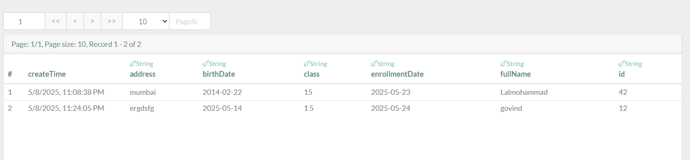

Description
This project is a Student Enrollment System that stores and manages student records using JsonPowerDB (JPDB), a high-performance database solution. It provides a web interface for:

Adding new student records

Updating existing student information

Viewing enrolled students

Built with:

HTML5, Bootstrap (Frontend)

JavaScript (Logic)

JsonPowerDB (Database)

Benefits of using JsonPowerDB
Lightning Fast - Optimized for high-speed operations
 Schema-less - No rigid structure required
 Web-based - Accessible via HTTP API
 Low Code - Simple integration with JavaScript
 Real-time - Instant data updates
 Secure - Token-based authentication

Release History
Version	Date	Changes Made
v1.0	2023-10-15	Initial release (Basic CRUD)
v1.1	2023-10-16	Fixed form enable/disable logic
v1.2	2023-10-17	Added proper error handling
Scope of Functionalities
Create: Add new students

Read: Fetch existing records

Update: Modify student details

Form Validation: Prevent empty submissions

Responsive UI: Works on all devices

Examples of Use
Adding a New Student
Enter Roll Number (e.g., "S101")

Fill other fields (Name, Class, etc.)

Click Save

Updating a Student
Enter existing Roll Number

Modify any field

Click Update

Project Status
 Completed & Fully Functional

All CRUD operations work

Tested with live JPDB database

Possible future improvements:

Search functionality

Bulk import/export

Sources
JsonPowerDB Docs: https://login2explore.com/jpdb/docs.html

Bootstrap: https://getbootstrap.com

Illustrations
Description
This project is a Student Enrollment System that stores and manages student records using JsonPowerDB (JPDB), a high-performance database solution. It provides a web interface for:

Adding new student records

Updating existing student information

Viewing enrolled students

Built with:

HTML5, Bootstrap (Frontend)

JavaScript (Logic)

JsonPowerDB (Database)

Benefits of using JsonPowerDB
Lightning Fast - Optimized for high-speed operations
 Schema-less - No rigid structure required
 Web-based - Accessible via HTTP API
 Low Code - Simple integration with JavaScript
 Real-time - Instant data updates
 Secure - Token-based authentication

Release History
Version	Date	Changes Made
v1.0	2023-10-15	Initial release (Basic CRUD)
v1.1	2023-10-16	Fixed form enable/disable logic
v1.2	2023-10-17	Added proper error handling
Scope of Functionalities
Create: Add new students

Read: Fetch existing records

Update: Modify student details

Form Validation: Prevent empty submissions

Responsive UI: Works on all devices

Examples of Use
Adding a New Student
Enter Roll Number (e.g., "S101")

Fill other fields (Name, Class, etc.)

Click Save

Updating a Student
Enter existing Roll Number

Modify any field

Click Update

Project Status
 Completed & Fully Functional

All CRUD operations work

Tested with live JPDB database

Possible future improvements:

Search functionality

Bulk import/export

Sources
JsonPowerDB Docs: https://login2explore.com/jpdb/docs.html

Bootstrap: https://getbootstrap.com

Illustrations

Form Preview

Database Response Sample
json
{
  "status": 200,
  "data": {
    "rec_no": 5,
    "record": {
      "id": "S101",
      "fullName": "Rahul Sharma",
      "class": "10"
    }
  }
}
Developed by Lalmohammad
Form Preview

Database Response Sample
json
{
  "status": 200,
  "data": {
    "rec_no": 5,
    "record": {
      "id": "S101",
      "fullName": "Rahul Sharma",
      "class": "10"
    }
  }
}
Developed by Lalmohammad
